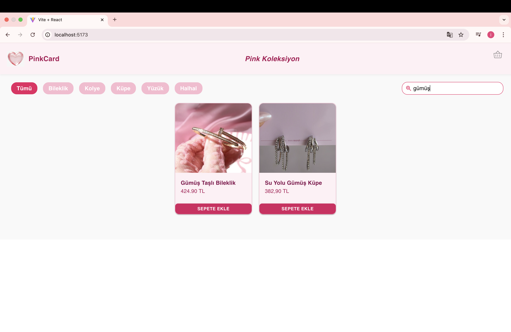
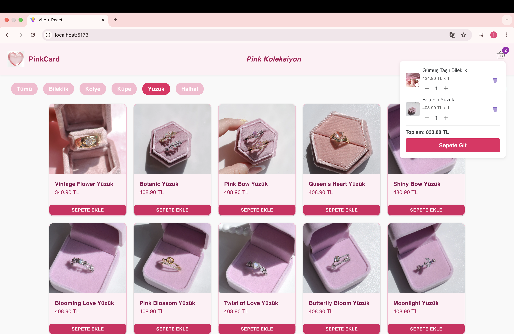
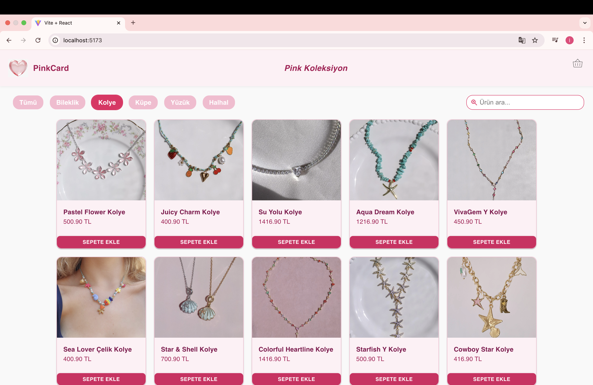
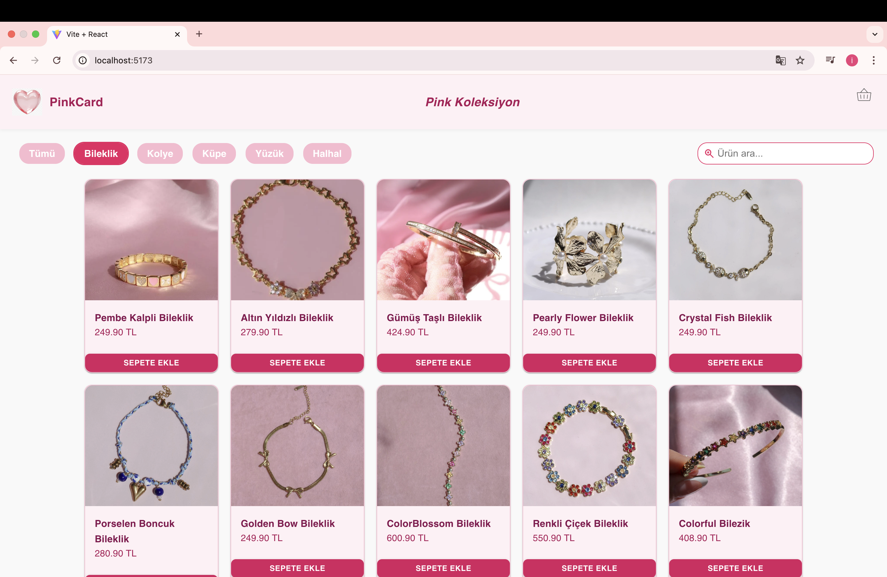
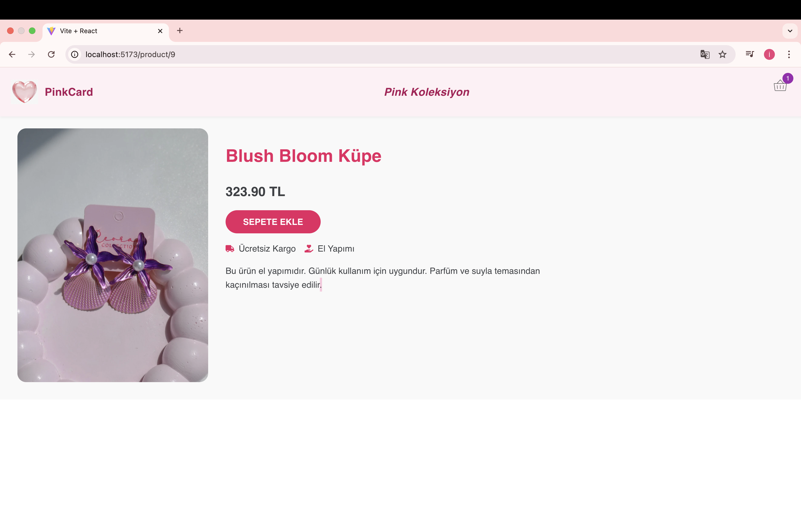
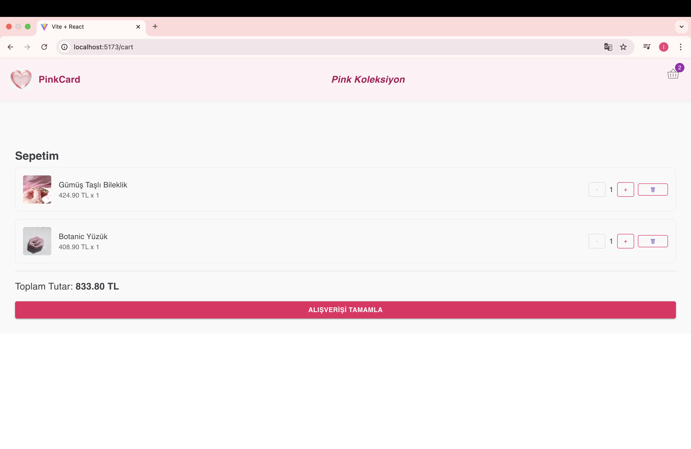
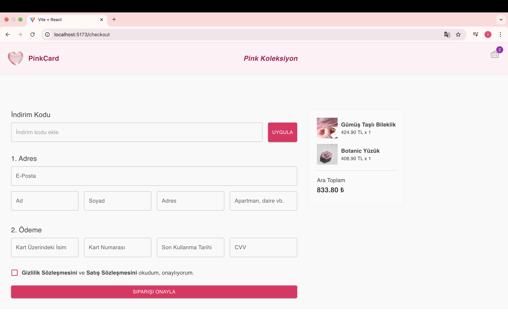
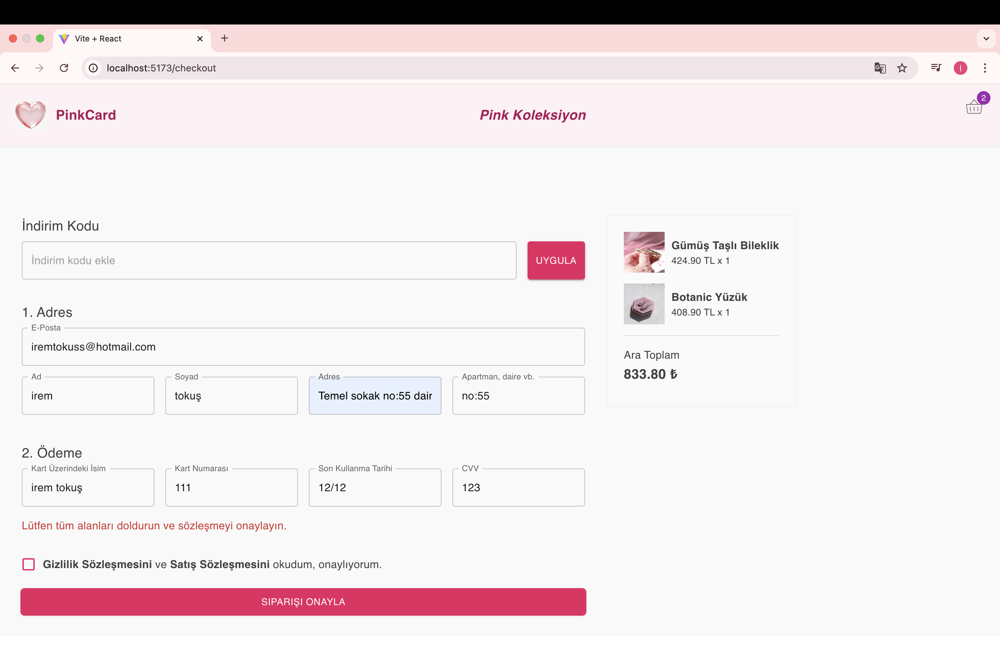

# 🛍️ PinkCard - React E-Ticaret Sitesi

Bu proje, sade ve modern bir kullanıcı arayüzü ile geliştirilmiş bir React tabanlı e-ticaret sitesidir. Kullanıcılar ürünleri inceleyebilir, sepete ekleyebilir ve ödeme sayfasına ilerleyebilir.

## 🚀 Özellikler

-  Ürün listesi ve detay sayfaları
-  Sepete ürün ekleme ve sepet görüntüleme
-  Kategoriye göre filtreleme
-  Ödeme sayfası
-  Modern UI tasarımı (Material UI ile)
-  React Router ile sayfa geçişleri

## 🛠️ Kullanılan Teknolojiler

- React
- React Router
- Material UI
- JavaScript (ES6+)
- Vite

## 📷 Ekran Görüntüleri

### 🏠 Ana Sayfa






### 🛍️ Ürün Detay Sayfası


### 🛒 Sepet Sayfası


### 💳 Ödeme Sayfası
  



## 💻 Kurulum

```bash
git clone https://github.com/iremtokus/PinkCard.git
cd PinkCard
npm install
npm run dev

✨ Geliştirici
👩‍💻 İrem Tokuş 
